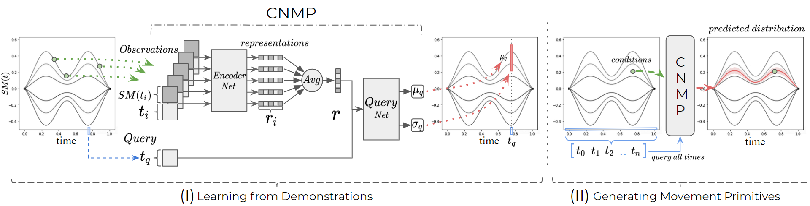
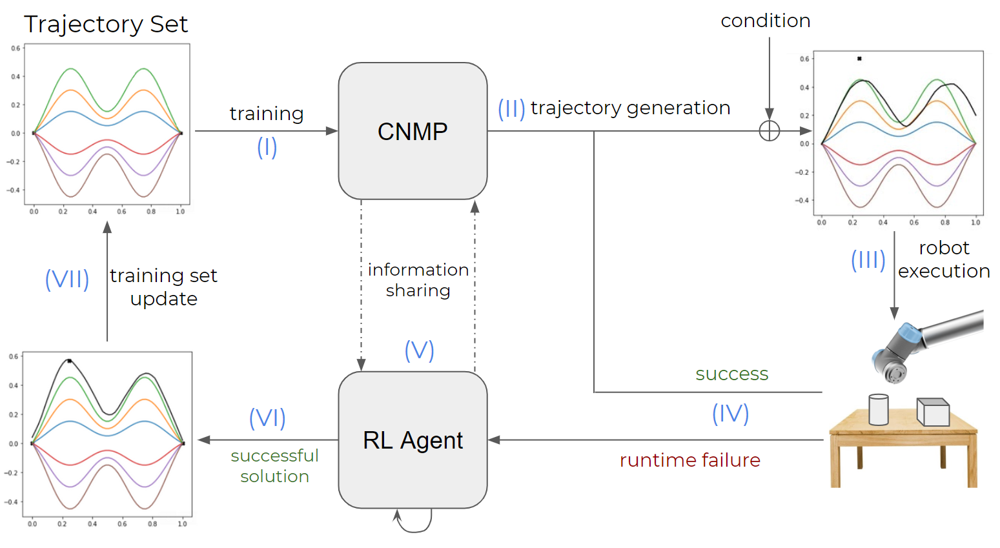

# CNMP+RL
Repository for the paper titled, "Adaptive  Conditional  Neural  Movement  Primitives  via  Representation Sharing  Between  Supervised  and  Reinforcement  Learning"

## CNMP:

## CNMP+RL:

### Requirements:

* Python 2.7
 
* Jupyter Notebook

* Tensorflow >= 1.8.0

* Keras >= 2.0.0

* Matplotlib

* Tqdm (optional)

### Contact Information:

* M. Tuluhan Akbulut , tuluhan.akbulut@boun.edu.tr

* M. Yunus Seker , yunus.seker1@boun.edu.tr

* Ahmet E. Tekden, tekdenahmet@gmail.com

* Emre Ugur, emre.ugur@boun.edur.tr
